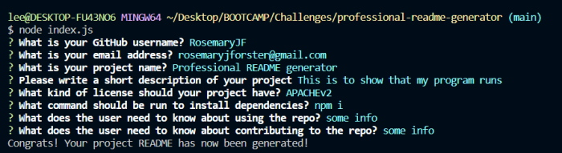

# professional-readme-generator

# Professional README Generator

## Description

I wanted to create a professional README generator so that a developer can quickly and easily generate a professional README for their project/application. It's easier to have a template to work from and to be able to quickly make it from your code editor rather than having to source an external template. 

I learnt a lot about asyncronous functions, using node, and debugging only from the terminal rather than having a console in dev tools to work with.

---

## Table of Contents

- [Installation](#installation)
- [Usage](#usage)
- [Features](#features)
- [Credits](#credits)

---

## Installation

You will need to clone the application from my GitHub account: https://github.com/RosemaryJF/professional-readme-generator, and have node installed. 

Once cloned to the local repository the user will need to run `npm install` so that the necessary packages are installed on the application. From there you will be able to run the application in your intergrated terminal with the following command: `node index.js`.

---

## Usage

Once the user has run npm install, they will have the packages available. 

Run node index.js

The console will then log the questions via inqurier. The answers are stored as data and a function will run to generate the README. 

Once complete the new README file will appear on the side bar. The user is then free to edit the README as they wish and move it to where it is needed.

I would advise using this application to generate the README and then cutting it into the applicaple project/application for it, this will minimise unnessacry packages on your project.

The console questions display as the below image depicts:

---

## Features

A license badge is displayed to quickly provide a reference point at the top of the README. This is only generated if a license is chosen. The License section of the README will also only generate if a license is chosen. Otherwise it will render an empty string.

---

## Credits

https://www.markdownguide.org/cheat-sheet/
https://www.youtube.com/watch?v=QFV7jzu8mKw&ab_channel=TheMasterClass
https://developer.mozilla.org/en-US/docs/Web/JavaScript/Reference/Classes
https://nodejs.org/api/fs.html#file-system
https://choosealicense.com/licenses/
https://sites.google.com/site/getsnippet/javascript-1/js---useful-techniques/shorthand-coding-techniques
https://stackoverflow.com/questions/44703395/undefined-value-when-using-fs-writefile
https://gist.github.com/lukas-h/2a5d00690736b4c3a7ba

---